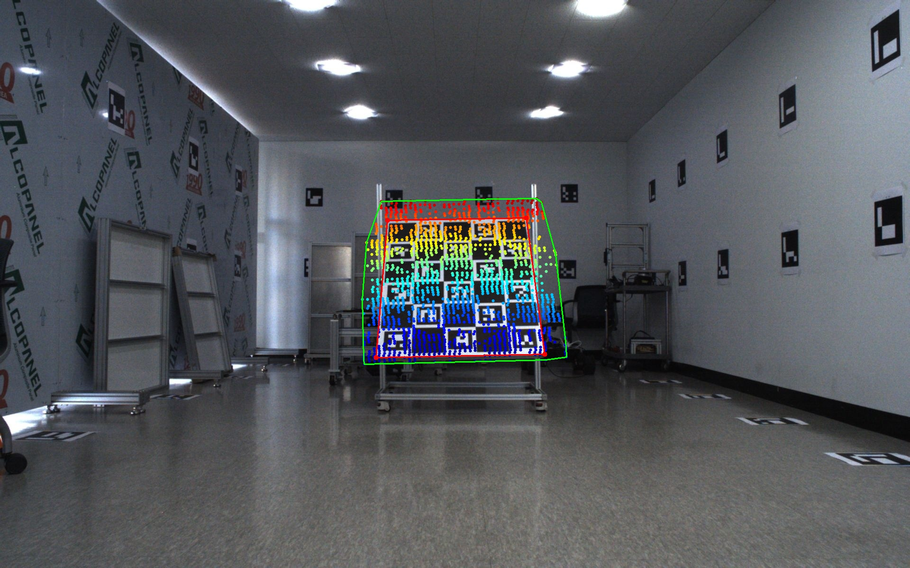

# Camera - Lidar Extrinsic Calibration based on IOU Optimization

## Explanation
[https://fuschia-ambert-efa.notion.site/Camera-Lidar-Extrinsic-calibration-1b384728f3f1809596c3ce1e6ba3dbe1?source=copy_link]

## How to use

1. rosbag 녹화 
2. data_extract.py → rosbag에서 데이터 추출
3. intrinsic_numpy.py → 카메라 intrinsic 계산
4. check_validation.py → 데이터 유효성 검사
5. extrinsic.py → extrinsic parameter 계산

## Result Images

Original image

Unoptimized IOU image

Optimized IOU image

Lidar projection image

## References

@article{huang2020improvements,
  author={J. {Huang} and J. W. {Grizzle}},
  journal={IEEE Access}, 
  title={Improvements to Target-Based 3D LiDAR to Camera Calibration}, 
  year={2020},
  volume={8},
  number={},
  pages={134101-134110},}
